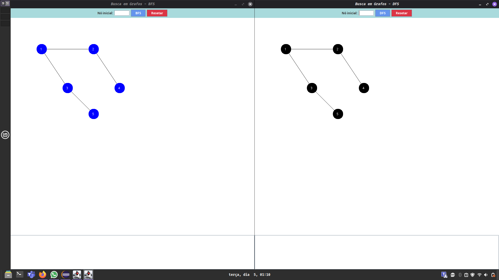
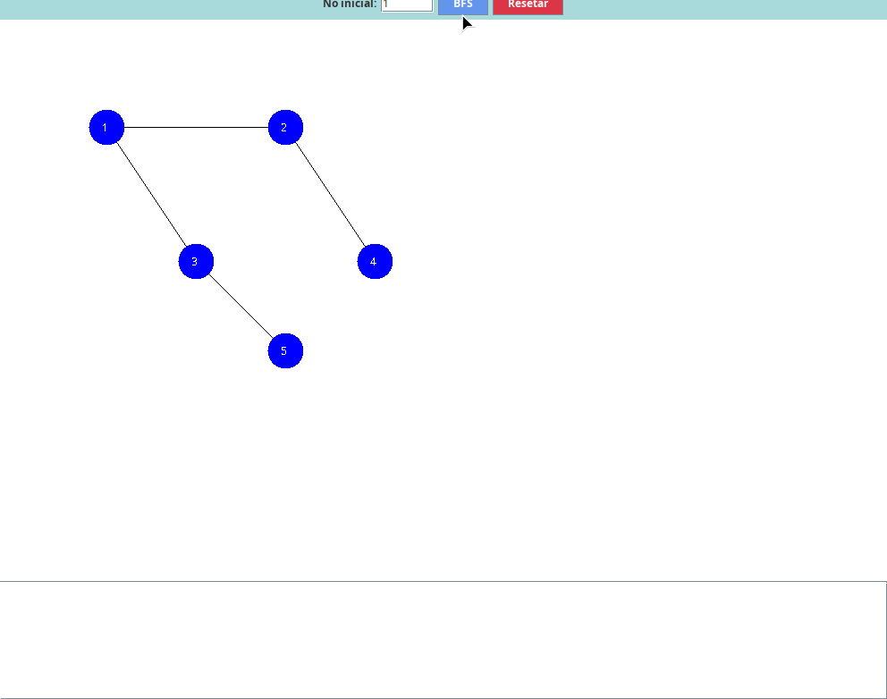
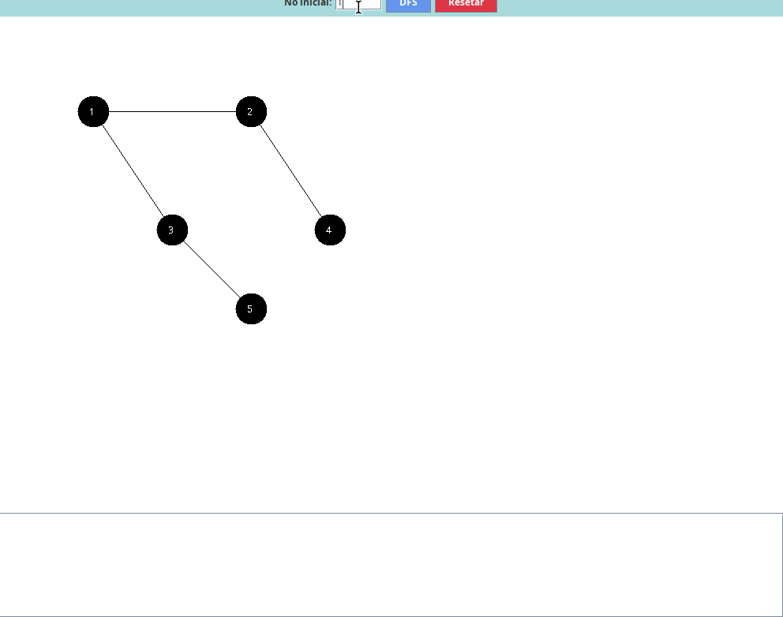

# Visualização de BFS e DFS em Java

Aplicação desenvolvida em Java utilizando Swing para demonstrar visualmente os algoritmos de busca em grafos: **Busca em Largura (BFS)** e **Busca em Profundidade (DFS)**.

---

## 🎯 Objetivo

Facilitar o entendimento dos algoritmos BFS e DFS através de uma interface gráfica interativa, permitindo visualizar o processo de visita dos nós em tempo real.

---

## 🖥️ Funcionalidades

- Interface gráfica com Java Swing
- Visualização de grafos com nós e arestas
- Execução dos algoritmos BFS e DFS
- Animação da busca em tempo real com uso do Timer
- Destaque visual dos nós visitados
- Tratamento de erros (entrada inválida)
- Botão para resetar o grafo

---
## Tecnologias Usadas

- **Java** – linguagem principal utilizada no desenvolvimento
- **Swing** – framework para construção da interface gráfica
- **AWT (Abstract Window Toolkit)** – utilizado para componentes gráficos e renderização
- **Java Collections Framework** – uso de estruturas como List, Queue e Map

---

## 📚 Conceitos Aplicados

- Estrutura de dados: Grafos
- Lista de adjacência
- Algoritmos de busca (BFS e DFS)
- Programação orientada a objetos
- Interface gráfica em Java

---

## Algoritmos Implementados


### BFS (Busca em Largura)
Percorre o grafo por níveis, visitando todos os vizinhos antes de avançar.

### DFS (Busca em Profundidade)
Percorre o grafo indo o mais fundo possível antes de retroceder.

---

## Demonstração







---

## 👨‍💻 Autor

Luís Fernando S. Ribas

---

## Como executar

1. Compile os arquivos:

```bash
javac MainFrame.java
